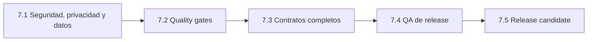

# Sprint 7 — Release hardening

## Estado

- **Estado:** en curso; 7.1A-7.1D, 7.2, 7.3, 7.4 y 7.5A cerrados. Solo queda `7.5B`, bloqueado por revisión humana e
  infraestructura externa; no hay trabajo de código pendiente que pueda hacerse en local
- **Objetivo de producto:** alcanzar una release candidate verificable sin ocultar deuda de seguridad, datos o calidad
- **Entrada:** Sprint 6.6 cerrado y baseline visual aprobado
- **Salida:** decisión explícita sobre `1.0.0` sustentada por el checklist de release

Sprint 7 no es una reescritura del motor ni una ampliación artística. Protege el producto existente, completa sus
contratos y demuestra que puede desplegarse y operarse con datos reales.

## Principios de ejecución

1. Seguridad e integridad preceden a automatización y release.
2. Ninguna migración remota se modifica sin inventario y evidencia del estado real.
3. Privacidad se define antes de ampliar campos, reporting o mutaciones de Admin.
4. Las pruebas se diseñan desde riesgos y contratos, no desde porcentajes de cobertura.
5. QA se ejecuta contra un único commit candidato y una matriz registrada.
6. Cada sub-sprint nace desde `main`, termina mediante Pull Request y actualiza roadmap, changelog y checklist.
7. `1.0.0` no se publica con excepciones abiertas de prioridad P0.

## Secuencia

La documentación preparatoria puede avanzar en paralelo. La implementación y el cierre respetarán el orden de gates.

## Sprint 7.1 — Seguridad, privacidad y baseline de datos

### Dirección aprobada

Sprint 7.1 se ejecutará en incrementos pequeños y verificables:

1. **7.1A — Seguridad y baseline de datos:** retirar `anon SELECT`, incorporar membresías y preparar instalación y
   actualización.
2. **7.1B — Identidad y sesión Admin:** OTP por email, sesión Supabase y cierre de sesión.
3. **7.1C — Provisionamiento y verificación:** operación manual controlada y matriz local de roles y acceso.
4. **7.1D — Ciclo de vida:** cerrar información, retención, exportación, corrección y borrado.

El RSVP seguirá admitiendo inserción anónima limitada. CAPTCHA, Edge Functions, MFA, OAuth, roles complejos y una
interfaz de gestión de usuarios quedan fuera de la primera solución salvo evidencia que justifique incorporarlos.

Sprint 7.1 está completamente cerrado: 7.1A-7.1D integradas en `main` y verificadas contra los gates de seguridad,
privacidad y datos. No se consultaron respuestas RSVP reales ni se modificó producción fuera del historial de
migraciones. Los aspectos operativos pendientes (aplicación de migraciones en remoto, verificación de pgTAP en CI
y procedimientos de backup/rollback) siguen abiertos en el `RELEASE_CHECKLIST.md` hasta Sprint 7.5.

`7.1A` y `7.1B` se desplegarán juntos: cerrar `anon SELECT` sin publicar el acceso OTP dejaría Admin sin una autoridad
válida. La PR permanecerá en borrador hasta completar ambos incrementos y su matriz de verificación.

### Objetivo

Establecer autoridad real sobre respuestas RSVP, definir su tratamiento y hacer reproducible el esquema de datos.

### Investigación obligatoria

- modelo de amenazas de Landing, RSVP, Admin, GitHub Actions y Supabase;
- inventario de datos personales, finalidad, acceso y ciclo de vida;
- estado real de tablas, funciones, roles, políticas RLS y migraciones remotas;
- alternativas de autenticación y autorización compatibles con el producto;
- estrategia de transición para instalaciones existentes.

### Decisiones requeridas

- ADR de identidad, sesión y autorización administrativa;
- autoridad por invitación y alcance de cada rol;
- política de inserción pública y protección contra abuso;
- tratamiento de restricciones alimentarias y texto libre;
- retención, exportación, corrección y borrado;
- baseline, migración, backup y rollback.

### Implementación prevista

- retirar la contraseña administrativa como autoridad de seguridad;
- proteger lecturas por usuario e invitación;
- limitar inserciones públicas al contrato necesario;
- aplicar y verificar RLS con clientes anónimo y autorizado;
- crear una baseline aplicable a una instalación vacía;
- conservar una ruta de actualización segura para proyectos existentes;
- actualizar configuración, documentación y operación.

### Criterio de salida

- no existen lecturas administrativas anónimas;
- ninguna credencial privilegiada forma parte del bundle;
- las políticas se verifican con los roles reales;
- una instalación vacía y una existente tienen procedimientos reproducibles;
- privacidad y ciclo de vida de datos están documentados;
- el checklist de seguridad, privacidad y base de datos queda completo o contiene una excepción P0 que bloquea el
  avance.

## Sprint 7.2 — Quality gates automatizados

### Estado actual

La dirección técnica está aceptada en `ADR-016`. La baseline incorpora Vitest, React Testing Library, Playwright
Chromium y pgTAP, con datos exclusivamente ficticios. Los jobs independientes `Application quality` y
`Database quality` pasaron en la Pull Request `#20` y sobre el commit integrado en `main`. Sprint 7.2 está completado.

### Objetivo

Detectar regresiones en contratos y flujos críticos antes de integrar cambios.

### Investigación obligatoria

- comparar Vitest u otras opciones compatibles con Vite para unitarias e integración;
- comparar Playwright u otra alternativa para E2E;
- definir qué adaptadores de Supabase se prueban localmente, mediante dobles o contra un entorno aislado;
- estimar coste, estabilidad y tiempo del workflow de Pull Request.

### Cobertura mínima por riesgo

- validación de `InvitationDefinition`;
- carga de catálogos y fallback de localización;
- Form Engine y reglas condicionales;
- mapper de respuestas legacy y actuales;
- contrato del Repository;
- Landing con capabilities principales;
- RSVP afirmativo, negativo, error y éxito;
- Admin protegido, carga, vacío, error y datos;
- ausencia de rutas y bundles cuando una capability está deshabilitada.

### Criterio de salida

- decisión de stack registrada;
- pruebas unitarias, integración y E2E representativas;
- workflow de PR con instalación reproducible, lint, build y pruebas;
- versiones de Node, pnpm, Actions y herramientas fijadas de forma mantenible;
- fallos de gates bloquean la integración.

## Sprint 7.3 — Contratos completos

### Estado actual

`ADR-017` queda aceptado con una fecha única para hero/countdown, instantes con offset, deadline exclusivo, SEO
localizado y validación estructural. El cierre se refleja sin recargar la página; lint, 39 pruebas unitarias, build, 6
recorridos E2E y 15 aserciones pgTAP están verdes localmente, y los dos quality gates alojados pasan en la Pull Request
`#21`.

### Objetivo

Eliminar propiedades declaradas sin efecto y consolidar fuentes únicas de verdad.

### Alcance

- implementar `seo` o retirarlo temporalmente mediante decisión;
- aplicar `rsvp.deadline` a CTA, ruta y envío con zona horaria explícita;
- unificar `event.date` y el target del countdown;
- validar IDs, URLs, contenido largo y estados vacíos;
- documentar compatibilidad y migración de configuraciones existentes.

### Criterio de salida

- ninguna propiedad pública relevante carece de consumidor o decisión;
- fecha, deadline y zona horaria tienen semántica única;
- los estados vacíos no producen UI rota;
- la guía de configuración coincide con los tipos y el runtime.

## Sprint 7.4 — QA de release

### Objetivo

Validar el producto completo con contenido, navegadores y dispositivos representativos.

### Progreso

El primer incremento corrige y verifica el selector móvil de mapas como riesgo concreto de viewport. La hoja inferior
usa viewport dinámico, respeta las áreas seguras y mantiene visibles las opciones automática, Google Maps y Apple Maps
en 320 × 568, 360 × 740 y 390 × 844 px. El popover de escritorio se revalidó en 1440 × 900 px.

Esta evidencia cubre únicamente el selector de mapas. No sustituye la matriz multidispositivo, de navegadores,
accesibilidad y estados definida a continuación.

El segundo incremento incorpora una matriz manual reproducible. Sobre `00ed191`, 59 recorridos pasan en Chromium,
Firefox, WebKit, Pixel 5 e iPhone 13 emulados. Chromium añade smoke tests de Landing y RSVP en 320, 390, 768 y 1440 px;
los selectores de idioma y mapas validan foco inicial, navegación por teclado, Escape y retorno al trigger. ES, EN y BG
mantienen idioma, SEO y countdown, y los cinco temas recorren Landing, RSVP y acceso Admin en móvil y escritorio.
La evidencia y sus límites se registran en
[`RELEASE_QA_MATRIX.md`](../05-audits/RELEASE_QA_MATRIX.md).

El tercer incremento, `7.4A`, resuelve `DC-018` sin modificar las paletas artísticas: `primary` deja de actuar como rol
de texto y `action`/`muted` protegen énfasis, metadatos, controles y foco. La suite añade contenido largo ficticio en
ES, EN y BG, reflow equivalente a zoom al 200 % y recorrido efectivo de teclado sobre Landing, RSVP y acceso Admin.
Royal, Boho, Dark, Magnolia y Linen se comparan en móvil, tablet y escritorio. La matriz protege además la alineación
geométrica del countdown; Magnolia estrena tres aperturas v2 con una zona superior de lectura estable. La evidencia
final y los límites se mantienen en [`RELEASE_QA_MATRIX.md`](../05-audits/RELEASE_QA_MATRIX.md).

El cuarto incremento, `7.4B`, cierra accesibilidad y automatización de despliegue: skip-link global, focus trap en
selector de idioma, `role="timer"` en countdown, landmarks en `InvitationRenderer`, foco inicial y errores accesibles
en login, propagación de errores reales de Supabase en Admin —cierta en el hook desde 7.4B, pero no observable al guardar una edición hasta que se corrigió el cierre prematuro del modal—, `aria-busy` en dashboard, presupuestos de bundle en
`vite.config.ts` y smoke test automático post-despliegue en GitHub Actions. Quedan como validación manual final
dispositivos físicos Safari iOS / Chrome Android y Lighthouse / Core Web Vitals. La evidencia se registra en
[`RELEASE_QA_MATRIX.md`](../05-audits/RELEASE_QA_MATRIX.md).

El quinto incremento, `7.4C`, agota la deuda de código detectable sin desplegar nada. Ocho claves `admin.actions.*`
existían solo en `es.ts`, de modo que el panel mostraba sus botones en español a un administrador en inglés o búlgaro;
`locales/catalogs.test.ts` fija ahora la paridad de catálogos, que ni TypeScript ni el aviso de DEV podían ver. Tres
dependencias de runtime sin un solo import salen del manifiesto, una arrastrando Puppeteer. El build emite una
Content-Security-Policy con el origen real de Supabase y `pnpm smoke:test` comprueba en el despliegue que existe y
apunta a donde debe. Los errores de consola pasan por `lib/devLog.ts` y dejan de exponer datos de invitados en
producción. La matriz de temas añade 320 px, el breakpoint que el backlog exige «con todos los temas» y que nunca
cubrió. `supabase/functions-check/` da a las Edge Functions su primer type-check. Este incremento se ejecutó en local
sin Pull Request: el repositorio remoto todavía no existe, así que el principio 6 no pudo aplicarse.

### Matriz mínima

| Dimensión    | Cobertura                                                    |
|--------------|--------------------------------------------------------------|
| Temas        | Royal, Boho, Dark, Magnolia y Linen                          |
| Páginas      | Landing, RSVP, éxito y Admin                                 |
| Viewports    | 320, 390, 768 y 1440 px                                      |
| Idiomas      | ES, EN y BG; invitación monolingüe y multilingüe             |
| Capabilities | con/sin RSVP y con/sin Admin                                 |
| Navegadores  | Safari iOS, Chrome Android y escritorio soportado            |
| Estados      | carga, vacío, error, retry, validación, envío y datos largos |

### Accesibilidad

- navegación completa por teclado y foco visible;
- cierre de overlays y retorno de foco;
- labels, `name`, `autocomplete`, ayuda y errores;
- estados asíncronos anunciados;
- contraste WCAG AA;
- zoom al 200 %;
- `prefers-reduced-motion`;
- revisión asistida con lector de pantalla.

### Rendimiento y robustez

- Lighthouse y Core Web Vitals con dispositivo, red, fecha y commit;
- dimensiones reservadas para imágenes y poster;
- vídeo bajo demanda;
- coste de fuentes y backgrounds medido;
- rutas y catálogos opcionales cargados de forma diferida;
- smoke test del despliegue representativo.

### Criterio de salida

- matriz registrada contra un único commit;
- defectos clasificados y bloqueos resueltos;
- checklist actualizado con evidencia;
- no se utiliza una validación parcial para afirmar compatibilidad total.

**Cerrado el 2026-09-04 con arrastre.** El trabajo de código del sprint está completo y verificado. Los tres puntos
restantes —dispositivos físicos, Lighthouse / Core Web Vitals y aprobación artística de `lavender` y `terracotta`— no
son implementación, así que no pueden completarse dentro de un sprint de QA: pasan a `7.5B` conservando su condición de
bloqueo. Se cierra el sprint, no la puerta de release.

## Sprint 7.5 — Deuda de código y release candidate

### Objetivo

Agotar el código que no depende de nada externo y, después, congelar y verificar el candidato antes de decidir la
publicación de `1.0.0`.

Se divide en dos tramos porque uno es ejecutable hoy y el otro no. Mezclarlos dejaría el trabajo de código parado
detrás de una aprobación artística y una medición que exige despliegue.

### 7.5A — Deuda de código no bloqueada · Completado el 2026-09-04

Cuatro elementos, todos aprobados por producto el 2026-09-04 y todos implementables sin desplegar nada. **Los cuatro
están entregados y verificados**; los criterios de cada uno se conservan abajo como registro, con la única excepción
que no pudo cumplirse marcada en su sitio.

**Evidencia de salida:** `tsc -b`, `pnpm lint`, 137 pruebas unitarias, 46 recorridos e2e en Chromium, 4 recorridos de
Content-Security-Policy contra el build, `pnpm build` y `pnpm run db:verify` con sus tres verificaciones —esquema,
comportamiento y rastro de auditoría— y `supabase/schema.sql` regenerado. Ejecutado en local y sin Pull Request: el
repositorio remoto sigue sin existir.

**Aparecido durante la ejecución, fuera del alcance previsto:**

- La política de seguridad quedó **más estricta** de lo que estaba. El plan daba `'unsafe-inline'` en `style-src` por
  necesario; la guardia de runtime demostró que no lo es, porque React escribe los estilos por CSSOM y `style-src` no
  gobierna eso. El comentario que afirmaba lo contrario en `vite.config.ts` era falso y está corregido.
- Se corrigió un falso positivo preexistente en la matriz de temas: medía la alineación del countdown en dos viajes al
  navegador, así que cualquier desplazamiento de layout entre ambos inventaba una desalineación. Fallaba en torno a 1
  de cada 3 ejecuciones completas.

#### 1. Modelo de locales con fallback explícito

**Valor:** el backlog lo condicionaba a valor demostrado. El fallo de las ocho claves `admin.actions.*` lo demuestra:
`bg.ts` hace spread de `en.ts`, así que TypeScript cuenta como presente cualquier clave heredada y una traducción
olvidada se sirve en inglés sin aviso.

**Criterios de aceptación:**

- ningún catálogo hereda de otro por spread estático; la cadena de fallback se declara, no se deduce leyendo el código;
- añadir un locale no obliga a decidir primero de quién hereda;
- `locales/catalogs.test.ts` sigue en verde, y su aserción de valores heredados deja de depender de una heurística.

**Dependencias:** ninguna.

#### 2. Guardia de runtime para la Content-Security-Policy

**Valor:** `pnpm smoke:test` comprueba que la política existe y nombra Supabase. No comprueba que no rompa un recurso
que se añada más adelante, y eso exige un navegador contra el build.

**Criterios de aceptación:**

- un recorrido contra el build servido falla si aparece una violación de CSP en Landing, RSVP o acceso Admin;
- el recorrido no duplica lo que ya cubre el smoke test del despliegue.

**Dependencias:** el `webServer` actual de Playwright arranca `pnpm dev` en el puerto 4173. Servir el build en paralelo
exige resolver ese conflicto sin duplicar la configuración.

#### 3. Confirmación previa al borrado e historial de auditoría

**Valor:** el borrado de una respuesta es irreversible desde el panel y hoy ocurre a un clic, sin registro de quién lo
hizo. Con varios administradores por invitación, nada permite reconstruir qué pasó.

**Criterios de aceptación:**

- borrar una respuesta exige confirmación explícita que nombre al invitado afectado;
- toda mutación administrativa —edición, borrado, restauración y cambio de plazo— registra autor, instante y respuesta
  afectada;
- el historial no expone datos del artículo 9 más allá de lo que el panel ya muestra.

**Dependencias:** una migración nueva, escribible y verificable en local con `pnpm run db:verify`; su aplicación contra
un proyecto real pertenece a `7.5B`.

**Restricción de privacidad, no negociable:** el historial es una categoría de dato personal que hoy no existe.
`purge_all_expired_rsvp()` borra las respuestas a los siete días, y un registro de auditoría que las sobreviva
reintroduce por la puerta de atrás lo que la purga eliminó. La migración debe purgar o anonimizar el historial en el
mismo ciclo, y [`DATA_PRIVACY_INVENTORY.md`](../05-audits/DATA_PRIVACY_INVENTORY.md) debe recogerlo antes de que la
tabla exista.

#### 4. Detalle móvil para respuestas largas

**Valor:** el panel se consulta desde el móvil el día de la boda. Una respuesta larga hoy se corta y no hay forma de
verla completa.

**Criterios de aceptación:**

- en 320 y 390 px una respuesta larga puede consultarse íntegra, sin overflow horizontal ni truncado silencioso;
- ~~la matriz responsive existente cubre el caso~~ — **no es posible.** Ver la limitación de abajo.

**Dependencias:** ninguna.

**Limitación de cobertura.** La tabla de respuestas vive detrás de la autenticación de Admin, y la suite e2e no puede
autenticarse sin un Supabase desplegado: sus recorridos llegan a la pantalla de acceso y no más allá. Las pruebas
unitarias fijan el marcado —etiqueta por celda y roles explícitos—, pero **ningún test automático mide el layout
apilado**. Se verificó una vez en navegador real con un banco de pruebas desechable, sobre el marcado que emite el
componente y el CSS compilado. Cerrar este hueco depende del mismo despliegue que `7.5B`.

#### Criterio de salida de 7.5A

Los cuatro elementos implementados y verificados por el gate completo —lint, `tsc -b`, unitarias, build, e2e,
`db:verify` y type-check de Edge Functions—, con documentación sincronizada. `7.5A` no depende de `G7-QA` ni de ningún
paso de infraestructura, así que puede cerrarse mientras `7.5B` sigue bloqueado.

### 7.5B — Release candidate · absorbido por Sprint 9

> **Movido el 2026-09-04 a [`SPRINT_9_PLAN.md`](./SPRINT_9_PLAN.md).** Todo lo que quedaba en este
> tramo depende de las mismas puertas externas que la puesta en producción, y mantener dos planes
> con las mismas dependencias obligaba a ejecutarlos en paralelo. El alcance se conserva abajo como
> registro; **las casillas vivas están en Sprint 9**, donde además se corrigen dos puntos que la
> migración a Cloudflare cambió: el smoke ya no tiene subpath y el rollback es promover un
> despliegue anterior.

**Alcance:**

- congelación funcional;
- versión coherente en paquete, changelog y tag;
- instalación limpia y gates completos;
- migración controlada antes del frontend que la consume;
- smoke test de URL pública, subpath y hash routes;
- procedimientos de rollback de frontend y base de datos;
- changelog final y limitaciones aceptadas;
- aprobación de producto, ingeniería y QA.

**Arrastrado desde 7.4:**

- Safari iOS y Chrome Android sobre hardware real;
- Lighthouse y Core Web Vitals sobre un despliegue representativo;
- aprobación artística de `lavender` y `terracotta`.

**Arrastrado desde 7.4C:** primera ejecución real de los gates de CI, incluido el job `edge-functions`, y los siete
pasos de activación de la purga descritos en [`PURGE_DEPLOYMENT.md`](../PURGE_DEPLOYMENT.md).

**Bloqueante que precede a todo lo anterior:** ninguna invitación con invitados reales sale antes de que el cron de
purga funcione. La conservación de siete días es una declaración del artículo 13.

### Criterio de salida

Hasta completar los puntos arrastrados no se prepara `1.0.0`. Publicarlo exige además que el
[`RELEASE_CHECKLIST.md`](../04-development/RELEASE_CHECKLIST.md) no contenga bloqueos P0 y que todas las excepciones
restantes tengan responsable, riesgo y fecha de resolución.

## Gates

| Gate          | Bloquea | Evidencia requerida                                         |
|---------------|---------|-------------------------------------------------------------|
| `G7-SEC`      | 7.2–7.5 | ADR, modelo de amenazas, RLS y autoridad verificadas        |
| `G7-DATA`     | 7.2–7.5 | baseline, historial remoto y rollback reproducibles         |
| `G7-PRIV`     | 7.4–7.5 | política de datos y procedimientos operativos               |
| `G7-CI`       | 7.4–7.5 | gates automáticos activos en Pull Requests                  |
| `G7-CONTRACT` | 7.4–7.5 | contratos completos y documentación sincronizada            |
| `G7-QA`       | 7.5B    | matriz funcional, accesibilidad, dispositivos y rendimiento |
| `G7-RC`       | `1.0.0` | checklist, smoke test, rollback y aprobaciones              |

## Fuera de alcance

- nuevas colecciones;
- sustitución tipográfica sin decisión de Nartea Studio;
- galería, historia o música;
- editor visual o SaaS;
- reporting avanzado;
- CLI y generalización a nuevos tipos de evento.

Estas capacidades permanecen en backlog y no deben entrar en Sprint 7 para acelerar o adornar la release.

## Preparación para empezar

El primer trabajo de Sprint 7.1 deberá ser exclusivamente de investigación y decisión:

1. inspeccionar el estado real de Supabase sin mutarlo;
2. producir el modelo de amenazas;
3. inventariar datos y flujos;
4. documentar la solución OTP y autorización por invitación aprobada;
5. completar la comparación remota y el plan de migración sin mutar producción;
6. implementar solo después de revisar la evidencia de investigación.
