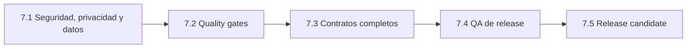

# Sprint 7 — Release hardening

## Estado

- **Estado:** en curso; investigación 7.1 completada e implementación pendiente
- **Objetivo de producto:** alcanzar una release candidate verificable sin ocultar deuda de seguridad, datos o calidad
- **Entrada:** Sprint 6.6 cerrado y baseline visual aprobado
- **Salida:** decisión explícita sobre `1.0.0` sustentada por el checklist de release

Sprint 7 no es una reescritura del motor ni una ampliación artística. Protege el producto existente, completa sus
contratos y demuestra que puede desplegarse y operarse con datos reales.

## Principios de ejecución

1. Seguridad e integridad preceden a automatización y release.
2. Ninguna migración remota se modifica sin inventario y evidencia del estado real.
3. Privacidad se define antes de ampliar campos, reporting o mutaciones de Admin.
4. Las pruebas se diseñan desde riesgos y contratos, no desde porcentajes de cobertura.
5. QA se ejecuta contra un único commit candidato y una matriz registrada.
6. Cada sub-sprint nace desde `main`, termina mediante Pull Request y actualiza roadmap, changelog y checklist.
7. `1.0.0` no se publica con excepciones abiertas de prioridad P0.

## Secuencia

La documentación preparatoria puede avanzar en paralelo. La implementación y el cierre respetarán el orden de gates.

## Sprint 7.1 — Seguridad, privacidad y baseline de datos

### Dirección aprobada

Sprint 7.1 se ejecutará en incrementos pequeños y verificables:

1. **7.1A — Identidad y autorización:** OTP por email, sesión Supabase y membresía por invitación.
2. **7.1B — Privacidad de lectura:** retirar `anon SELECT` y verificar RLS con usuarios asignados y no asignados.
3. **7.1C — Baseline de datos:** comparar remoto y local sin mutaciones, y preparar instalación y actualización.
4. **7.1D — Ciclo de vida:** cerrar información, retención, exportación, corrección y borrado.

El RSVP seguirá admitiendo inserción anónima limitada. CAPTCHA, Edge Functions, MFA, OAuth, roles complejos y una
interfaz de gestión de usuarios quedan fuera de la primera solución salvo evidencia que justifique incorporarlos.

La investigación local y la auditoría remota de metadatos están completadas. No se consultaron respuestas RSVP ni se
modificó producción. La implementación comienza cuando se apruebe el plan incremental derivado de esta evidencia.

`7.1A` y `7.1B` se desplegarán juntos: cerrar `anon SELECT` sin publicar el acceso OTP dejaría Admin sin una autoridad
válida. La PR permanecerá en borrador hasta completar ambos incrementos y su matriz de verificación.

### Objetivo

Establecer autoridad real sobre respuestas RSVP, definir su tratamiento y hacer reproducible el esquema de datos.

### Investigación obligatoria

- modelo de amenazas de Landing, RSVP, Admin, GitHub Actions y Supabase;
- inventario de datos personales, finalidad, acceso y ciclo de vida;
- estado real de tablas, funciones, roles, políticas RLS y migraciones remotas;
- alternativas de autenticación y autorización compatibles con el producto;
- estrategia de transición para instalaciones existentes.

### Decisiones requeridas

- ADR de identidad, sesión y autorización administrativa;
- autoridad por invitación y alcance de cada rol;
- política de inserción pública y protección contra abuso;
- tratamiento de restricciones alimentarias y texto libre;
- retención, exportación, corrección y borrado;
- baseline, migración, backup y rollback.

### Implementación prevista

- retirar la contraseña administrativa como autoridad de seguridad;
- proteger lecturas por usuario e invitación;
- limitar inserciones públicas al contrato necesario;
- aplicar y verificar RLS con clientes anónimo y autorizado;
- crear una baseline aplicable a una instalación vacía;
- conservar una ruta de actualización segura para proyectos existentes;
- actualizar configuración, documentación y operación.

### Criterio de salida

- no existen lecturas administrativas anónimas;
- ninguna credencial privilegiada forma parte del bundle;
- las políticas se verifican con los roles reales;
- una instalación vacía y una existente tienen procedimientos reproducibles;
- privacidad y ciclo de vida de datos están documentados;
- el checklist de seguridad, privacidad y base de datos queda completo o contiene una excepción P0 que bloquea el avance.

## Sprint 7.2 — Quality gates automatizados

### Objetivo

Detectar regresiones en contratos y flujos críticos antes de integrar cambios.

### Investigación obligatoria

- comparar Vitest u otras opciones compatibles con Vite para unitarias e integración;
- comparar Playwright u otra alternativa para E2E;
- definir qué adaptadores de Supabase se prueban localmente, mediante dobles o contra un entorno aislado;
- estimar coste, estabilidad y tiempo del workflow de Pull Request.

### Cobertura mínima por riesgo

- validación de `InvitationDefinition`;
- carga de catálogos y fallback de localización;
- Form Engine y reglas condicionales;
- mapper de respuestas legacy y actuales;
- contrato del Repository;
- Landing con capabilities principales;
- RSVP afirmativo, negativo, error y éxito;
- Admin protegido, carga, vacío, error y datos;
- ausencia de rutas y bundles cuando una capability está deshabilitada.

### Criterio de salida

- decisión de stack registrada;
- pruebas unitarias, integración y E2E representativas;
- workflow de PR con instalación reproducible, lint, build y pruebas;
- versiones de Node, pnpm, Actions y herramientas fijadas de forma mantenible;
- fallos de gates bloquean la integración.

## Sprint 7.3 — Contratos completos

### Objetivo

Eliminar propiedades declaradas sin efecto y consolidar fuentes únicas de verdad.

### Alcance

- implementar `seo` o retirarlo temporalmente mediante decisión;
- aplicar `rsvp.deadline` a CTA, ruta y envío con zona horaria explícita;
- unificar `event.date` y el target del countdown;
- validar IDs, URLs, contenido largo y estados vacíos;
- documentar compatibilidad y migración de configuraciones existentes.

### Criterio de salida

- ninguna propiedad pública relevante carece de consumidor o decisión;
- fecha, deadline y zona horaria tienen semántica única;
- los estados vacíos no producen UI rota;
- la guía de configuración coincide con los tipos y el runtime.

## Sprint 7.4 — QA de release

### Objetivo

Validar el producto completo con contenido, navegadores y dispositivos representativos.

### Matriz mínima

| Dimensión | Cobertura |
|---|---|
| Temas | Royal, Boho, Dark, Magnolia y Linen |
| Páginas | Landing, RSVP, éxito y Admin |
| Viewports | 320, 390, 768 y 1440 px |
| Idiomas | ES, EN y BG; invitación monolingüe y multilingüe |
| Capabilities | con/sin RSVP y con/sin Admin |
| Navegadores | Safari iOS, Chrome Android y escritorio soportado |
| Estados | carga, vacío, error, retry, validación, envío y datos largos |

### Accesibilidad

- navegación completa por teclado y foco visible;
- cierre de overlays y retorno de foco;
- labels, `name`, `autocomplete`, ayuda y errores;
- estados asíncronos anunciados;
- contraste WCAG AA;
- zoom al 200 %;
- `prefers-reduced-motion`;
- revisión asistida con lector de pantalla.

### Rendimiento y robustez

- Lighthouse y Core Web Vitals con dispositivo, red, fecha y commit;
- dimensiones reservadas para imágenes y poster;
- vídeo bajo demanda;
- coste de fuentes y backgrounds medido;
- rutas y catálogos opcionales cargados de forma diferida;
- smoke test del despliegue representativo.

### Criterio de salida

- matriz registrada contra un único commit;
- defectos clasificados y bloqueos resueltos;
- checklist actualizado con evidencia;
- no se utiliza una validación parcial para afirmar compatibilidad total.

## Sprint 7.5 — Release candidate

### Objetivo

Congelar y verificar el candidato antes de decidir la publicación de `1.0.0`.

### Alcance

- congelación funcional;
- versión coherente en paquete, changelog y tag;
- instalación limpia y gates completos;
- migración controlada antes del frontend que la consume;
- smoke test de URL pública, subpath y hash routes;
- procedimientos de rollback de frontend y base de datos;
- changelog final y limitaciones aceptadas;
- aprobación de producto, ingeniería y QA.

### Criterio de salida

`1.0.0` solo puede publicarse si el
[`RELEASE_CHECKLIST.md`](../04-development/RELEASE_CHECKLIST.md) no contiene bloqueos P0 y todas las excepciones
restantes tienen responsable, riesgo y fecha de resolución.

## Gates

| Gate | Bloquea | Evidencia requerida |
|---|---|---|
| `G7-SEC` | 7.2–7.5 | ADR, modelo de amenazas, RLS y autoridad verificadas |
| `G7-DATA` | 7.2–7.5 | baseline, historial remoto y rollback reproducibles |
| `G7-PRIV` | 7.4–7.5 | política de datos y procedimientos operativos |
| `G7-CI` | 7.4–7.5 | gates automáticos activos en Pull Requests |
| `G7-CONTRACT` | 7.4–7.5 | contratos completos y documentación sincronizada |
| `G7-QA` | 7.5 | matriz funcional, accesibilidad, dispositivos y rendimiento |
| `G7-RC` | `1.0.0` | checklist, smoke test, rollback y aprobaciones |

## Fuera de alcance

- nuevas colecciones;
- sustitución tipográfica sin decisión de Nartea Studio;
- galería, historia o música;
- editor visual o SaaS;
- reporting avanzado;
- CLI y generalización a nuevos tipos de evento.

Estas capacidades permanecen en backlog y no deben entrar en Sprint 7 para acelerar o adornar la release.

## Preparación para empezar

El primer trabajo de Sprint 7.1 deberá ser exclusivamente de investigación y decisión:

1. inspeccionar el estado real de Supabase sin mutarlo;
2. producir el modelo de amenazas;
3. inventariar datos y flujos;
4. documentar la solución OTP y autorización por invitación aprobada;
5. completar la comparación remota y el plan de migración sin mutar producción;
6. implementar solo después de revisar la evidencia de investigación.
