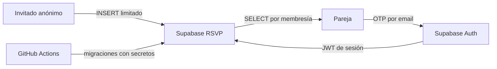

# Modelo de amenazas de seguridad

## Estado

- **Fecha:** 2026-08-02
- **Alcance:** Landing, RSVP, Admin, Supabase y despliegue en Cloudflare Pages
- **Fase:** Sprint 7.1, investigación aprobada
- **Última revisión:** análisis estático y auditoría remota de metadatos completados

## Objetivo

Identificar qué debemos proteger antes de modificar autenticación, autorización o datos. Este documento prioriza riesgos
reales del producto actual y evita añadir controles propios de un sistema empresarial que Nartea no necesita.

## Activos y límites de confianza

| Activo                     | Sensibilidad                    | Autoridad esperada                     |
|----------------------------|---------------------------------|----------------------------------------|
| Respuestas RSVP            | Datos personales                | Pareja asignada a la invitación        |
| Restricciones alimentarias | Potencialmente sensibles        | Pareja asignada y operación autorizada |
| Exportación CSV            | Copia local de datos personales | Pareja autenticada                     |
| Configuración pública      | Pública por diseño              | Navegador anónimo                      |
| Clave anónima de Supabase  | Pública por diseño              | RLS limita sus capacidades             |
| Sesión administrativa      | Privada                         | Supabase Auth y RLS                    |
| Credenciales de despliegue | Secretas                        | GitHub Actions, nunca el bundle        |

La frontera de seguridad no puede estar en React. El navegador controla la experiencia; Supabase Auth identifica al
usuario y Row Level Security (RLS) autoriza cada operación.

## Flujos relevantes

## Riesgos priorizados

| ID     | Amenaza actual                                                            |        Impacto | Probabilidad |    Prioridad | Tratamiento aprobado                                                                           |
|--------|---------------------------------------------------------------------------|---------------:|-------------:|-------------:|------------------------------------------------------------------------------------------------|
| SEC-01 | Lectura anónima global de `rsvp_responses`                                |        Crítico |         Alta |           P0 | Eliminar la política `anon SELECT` y autorizar por usuario e invitación.                       |
| SEC-02 | `VITE_ADMIN_PASSWORD` y `sessionStorage` simulan autenticación solo en UI |           Alto |         Alta |           P0 | Sustituir por email OTP, sesión Supabase y RLS.                                                |
| SEC-03 | Una pareja autenticada puede intentar leer otra invitación                |           Alto |        Media |           P0 | Tabla de membresía y política RLS con `auth.uid()`.                                            |
| SEC-04 | Inserciones públicas automatizadas o con contenido excesivo               |     Medio/alto |        Media |           P1 | Validación y límites en base de datos; CAPTCHA solo si aparece abuso.                          |
| SEC-05 | Abuso o enumeración del formulario de OTP                                 |          Medio |        Media |           P1 | `shouldCreateUser: false`, respuesta neutra y límites de Supabase Auth.                        |
| SEC-06 | Sesión abierta en un dispositivo compartido                               |          Medio |        Media |           P1 | Cierre de sesión visible y documentación de uso; política temporal solo si se justifica.       |
| SEC-07 | CSV descargado permanece fuera del control de la aplicación               |          Medio |        Media |           P1 | Aviso operativo, minimización y borrado; mantener protección contra fórmulas.                  |
| SEC-08 | Texto libre o errores terminan en logs                                    |          Medio |         Baja |           P1 | No registrar payloads; mensajes de error sin datos personales.                                 |
| SEC-09 | Esquema remoto y migraciones locales divergen                             |           Alto |        Media | P0 operativo | Crear baseline solo tras comparar el estado remoto de forma no mutante.                        |
| SEC-10 | Un secreto privilegiado entra en el frontend                              |        Crítico |         Baja |           P0 | Solo URL y anon key en Vite; secretos administrativos quedan en GitHub Actions.                |
| SEC-11 | Función `SECURITY DEFINER` expuesta por RPC                               |        Crítico |   Confirmada |           P0 | Revocar `EXECUTE` nombrando `anon` y `authenticated`, no solo `PUBLIC`. Ver la nota de abajo.  |
| SEC-13 | El plazo de RSVP cierra en la interfaz pero no en la API                  |           Alto |   Confirmada |           P0 | `is_rsvp_open` dentro del `WITH CHECK` de la inserción anónima; falla cerrado.                 |
| SEC-14 | Dos bodas comparten `wedding_slug` y, con él, administradores y datos     |        Crítico |         Baja |           P0 | Unicidad en `invitations.wedding_slug`; pipeline y script de provisión fallan en rojo.         |
| SEC-12 | Grants de tabla más amplios de lo necesario                               |     Medio/alto |        Media |           P1 | Revocar operaciones innecesarias y conceder solo `anon INSERT` y `authenticated SELECT`.       |
| SEC-15 | La invitación se embebe en la página de un tercero                        |     Medio/alto |         Baja |           P1 | `frame-ancestors 'none'` en la cabecera. Ver la nota de abajo: era **imposible** de mitigar con el host anterior. |

### SEC-15 — una amenaza que el host anterior no permitía cerrar

Envolver la invitación en un `iframe` dentro de otra página permite superponerle contenido. Importa
más de lo que su probabilidad sugiere porque la sección de regalos publica un IBAN y un número de
Bizum: una copia enmarcada con otro número encima es fraude difícil de distinguir a simple vista.

La única defensa es `frame-ancestors`, y esa directiva **el navegador la ignora cuando llega en un
`<meta>`**. Mientras el sitio se sirvió desde GitHub Pages, que no permite cabeceras propias, la
amenaza no era mitigable: no estaba pendiente por descuido, era inalcanzable. Migrar a Cloudflare
Pages en Sprint 8 la cerró, y `e2e/csp.spec.ts` comprueba en cada ejecución que la invitación se
niega a renderizarse dentro de un frame.

### SEC-11 — la mitigación documentada no bastaba

Se dio por buena «revocar `EXECUTE` público». **No cierra el agujero en Supabase.** Sus privilegios por defecto
conceden `EXECUTE` sobre cada función nueva de `public` **directamente** a `anon` y `authenticated`, y un grant directo
sobrevive a un `REVOKE ... FROM PUBLIC`.

Consecuencia real, encontrada el 31 de agosto de 2026 al ejecutar por primera vez las suites pgTAP del repositorio:
`get_pending_purge_warnings` era ejecutable por `anon`. Es `SECURITY DEFINER` sobre `auth.users` y devuelve el correo
de cada administrador de cada boda a punto de purgarse; con la anon key que viaja en el bundle, cualquiera podía
cosecharlos. `purge_all_expired_rsvp`, que borra datos, estaba igual de expuesta.

Regla a partir de ahora: **toda función `SECURITY DEFINER` en `public` revoca nombrando los roles**, y una aserción
pgTAP lo fija. Comprobar que la policy o el revoke existen no prueba nada; hay que ejercitarlo por rol.

## Controles que no necesitamos en la primera versión

- MFA obligatorio.
- OAuth social.
- Roles empresariales complejos.
- Panel de gestión de usuarios.
- Edge Function únicamente para autenticar la lectura.
- Contraseña compartida por invitación.
- CAPTCHA preventivo sin evidencia de abuso.

Estos controles podrán evaluarse si el riesgo o la operación cambian. No forman parte de la solución inicial.

## Casos de abuso que deberán verificarse

1. Un cliente anónimo no puede seleccionar ninguna respuesta.
2. Un usuario autenticado sin membresía no puede leer respuestas.
3. La pareja de la invitación A no puede leer la invitación B aunque conozca su identificador.
4. Una dirección no provisionada no crea una cuenta mediante OTP.
5. Cerrar sesión invalida la experiencia administrativa del navegador.
6. Los campos públicos rechazan tamaños y formas fuera del contrato.
7. Los logs del navegador y del workflow no contienen respuestas ni tokens.

## Criterio de salida

`G7-SEC` solo podrá cerrarse cuando estos casos tengan pruebas reproducibles con clientes anónimo, autenticado con
membresía y autenticado sin membresía. El inventario remoto confirma el riesgo, pero no sustituye esas pruebas.

## Fuentes

- [Supabase: Row Level Security](https://supabase.com/docs/guides/database/postgres/row-level-security)
- [Supabase: Auth](https://supabase.com/docs/guides/auth)
- [Supabase: Sessions](https://supabase.com/docs/guides/auth/sessions)
- [Supabase: Auth rate limits](https://supabase.com/docs/guides/auth/rate-limits)
